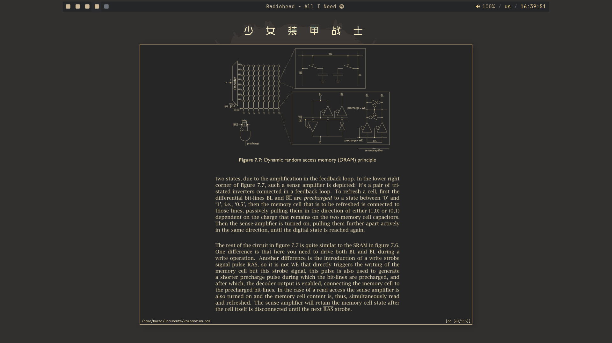
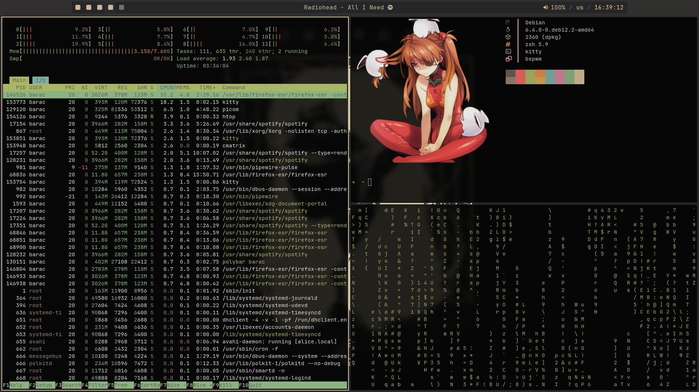
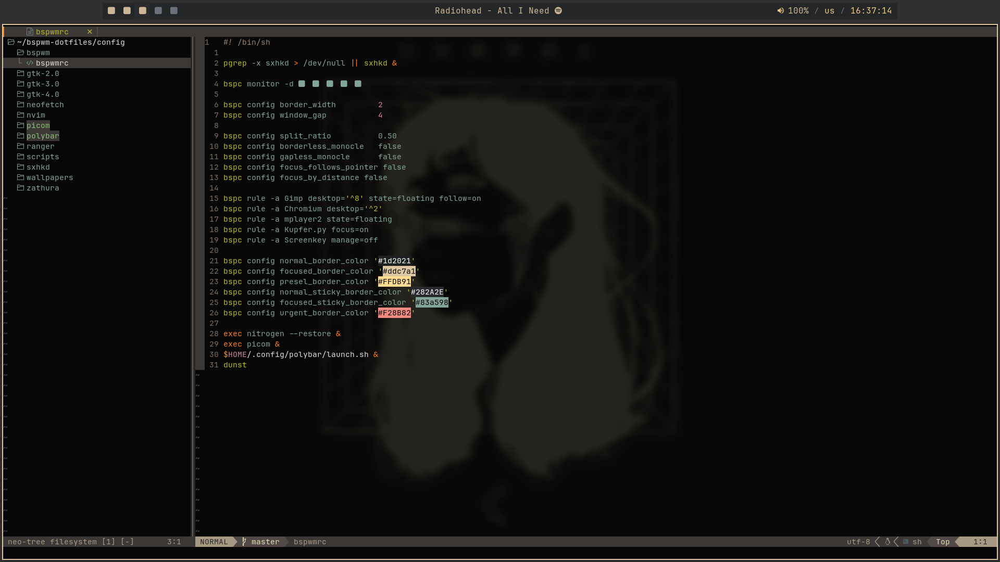

```ocaml
bspwm gruvbox
```
# images

 
 
 
 

----------

# Debian
using `nala`

```
sudo nala install zathura polybar dunst thunar ranger zathura-cb neofetch bspwm sxhkd xorg nitrogen pamixer picom kitty rofi zsh
```
```bash
git clone https://github.com/calmestend/bspwm-dotfiles
cd bspwm-dotfiles
chmod +x config/scripts/*
chmod +x config/polybar/launch.sh
cp -r config/* ~/.config
```
Gruvbox-GTK-theme
```
https://github.com/Fausto-Korpsvart/Gruvbox-GTK-Theme.git
```
Picom fork
```
https://github.com/ibhagwan/picom.git
```
